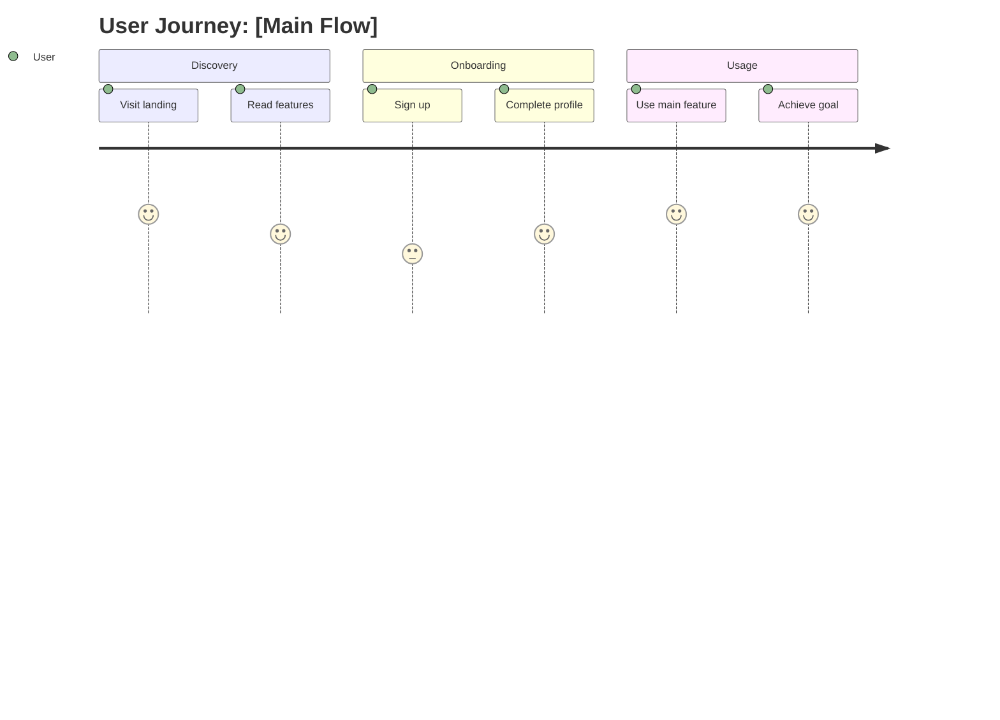
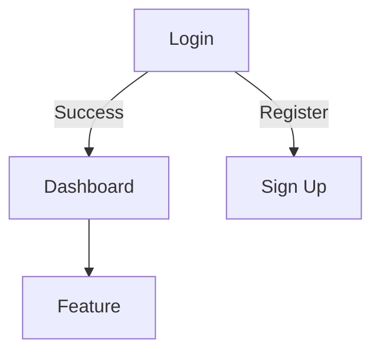

## Purpose

Generate **Basic Design (外部設計)** following IPA standard with:
- Customer Journey Experience (CJX)
- Design reference support (URL/image)
- Platform-specific UX patterns

Output: `docs/UX_SPEC.md`

---

## Project Type Detection

| Project Type | UX Spec Focus | CJX Adaptation |
|--------------|---------------|----------------|
| **Web App** | Screens, components, responsive | Visual journey |
| **Desktop App** | Windows, dialogs, menus | Productivity journey |
| **CLI Tool** | Commands, output, prompts | Task completion journey |
| **MCP Server** | Tool descriptions, prompts | Developer journey |
| **Chatbot/RAG** | Conversation flows, responses | Query resolution journey |
| **Library/SDK** | API docs, examples | Integration journey |

---

## Input

**Required:**
- `docs/SRD.md`

**Optional:**
- `$ARGUMENTS` = Reference URL or image path for design inspiration
- `docs/tech-stack.md`

<reference>
$ARGUMENTS
</reference>

---

## User Research Integration

**Before starting UI design, check for USER_RESEARCH.md:**

```
if docs/USER_RESEARCH.md exists:
  1. Read personas and journey maps
  2. Map journey stages to screens
  3. Add "Design Rationale" to each screen
  4. Apply emotional design (CJX)
else:
  Proceed with UI design (without rationale)
```

**For each screen, add Design Rationale section:**

```markdown
### S-XX: [Screen Name]

**Journey Stage:** [Discovery/Onboarding/Usage/Retention/Advocacy]
**User Emotion:** [From journey map]
**Persona:** [Which persona uses this screen]

**Design Rationale:**
- Decision 1: [Why] (addresses [pain point/goal from persona])
- Decision 2: [Why]

[Rest of screen spec...]
```

**Example:**
```markdown
### S-02: Dashboard

**Journey Stage:** Usage (Engaged → Productive)
**User Emotion:** Focused, wants efficiency
**Persona:** Sarah (SaaS PM)

**Design Rationale:**
- Quick actions prominent: Sarah values speed (persona behavior)
- Data visualization: Sarah is data-driven, needs metrics at a glance
- Minimal navigation: Reduce tool-switching overhead (persona pain point)
```

---

## Design Reference Handling

### If URL provided:
1. Use `WebFetch` to analyze the reference website
2. Extract: color palette, typography, layout patterns, spacing
3. Use `chrome-devtools` skill to screenshot if needed
4. Apply extracted design system to UI_SPEC

### If Image provided:
1. Use `ai-multimodal` skill to analyze the design image
2. Extract: colors, fonts, layout, spacing, component styles
3. Apply to UI_SPEC

### If no reference:
1. Generate default design system based on SRD
2. Ask user for color preference (or use neutral palette)

---

## Output: docs/UI_SPEC.md

```markdown
# UI Specification (Basic Design)

## 1. Customer Journey Experience (CJX)

### User Personas
| Persona | Role | Goals | Pain Points |
|---------|------|-------|-------------|
| P-01 | [Role] | [Goals] | [Pain points] |

### Customer Journey Map



### Key Touchpoints
| Stage | Touchpoint | User Emotion | Design Goal |
|-------|------------|--------------|-------------|
| Discovery | Landing page | Curious | Build trust |
| Onboarding | Sign up form | Hesitant | Reduce friction |
| Usage | Dashboard | Engaged | Enable efficiency |

### Success Metrics
- Task completion rate: [target]
- Time to complete: [target]
- Error rate: [target]
- User satisfaction: [target]

---

## 2. Design System

### Design Reference
> Source: [URL or image path if provided]
> Style: [Extracted style description]

### Color Palette

**Primary Colors:**
| Name | Hex | RGB | Usage |
|------|-----|-----|-------|
| Primary | #[extracted] | rgb() | Buttons, links, CTAs |
| Primary Dark | #[extracted] | rgb() | Hover states |
| Primary Light | #[extracted] | rgb() | Backgrounds |

**Secondary Colors:**
| Name | Hex | RGB | Usage |
|------|-----|-----|-------|
| Secondary | #[extracted] | rgb() | Secondary actions |
| Accent | #[extracted] | rgb() | Highlights |

**Neutral Colors:**
| Name | Hex | RGB | Usage |
|------|-----|-----|-------|
| Gray 900 | #[extracted] | rgb() | Text primary |
| Gray 600 | #[extracted] | rgb() | Text secondary |
| Gray 300 | #[extracted] | rgb() | Borders |
| Gray 100 | #[extracted] | rgb() | Backgrounds |

**Semantic Colors:**
| Name | Hex | Usage |
|------|-----|-------|
| Success | #10B981 | Success messages |
| Warning | #F59E0B | Warnings |
| Error | #EF4444 | Errors |
| Info | #3B82F6 | Information |

### Typography

**Font Family:**
| Type | Font | Fallback |
|------|------|----------|
| Primary | [Extracted or suggested] | sans-serif |
| Mono | [For code] | monospace |

**Font Scale:**
| Element | Size | Weight | Line Height |
|---------|------|--------|-------------|
| H1 | 36px / 2.25rem | 700 | 1.2 |
| H2 | 30px / 1.875rem | 600 | 1.3 |
| H3 | 24px / 1.5rem | 600 | 1.4 |
| Body | 16px / 1rem | 400 | 1.5 |
| Small | 14px / 0.875rem | 400 | 1.5 |
| Caption | 12px / 0.75rem | 400 | 1.4 |

### Spacing System
Base unit: 4px

| Name | Value | Usage |
|------|-------|-------|
| xs | 4px | Tight spacing |
| sm | 8px | Component internal |
| md | 16px | Component gaps |
| lg | 24px | Section gaps |
| xl | 32px | Large sections |
| 2xl | 48px | Page sections |

### Border & Shadow

**Border Radius:**
| Name | Value | Usage |
|------|-------|-------|
| sm | 4px | Buttons, inputs |
| md | 8px | Cards |
| lg | 16px | Modals |
| full | 9999px | Avatars, pills |

**Shadows:**
| Name | Value | Usage |
|------|-------|-------|
| sm | 0 1px 2px rgba(0,0,0,0.05) | Subtle elevation |
| md | 0 4px 6px rgba(0,0,0,0.1) | Cards |
| lg | 0 10px 15px rgba(0,0,0,0.1) | Dropdowns, modals |

---

## 3. Screen Specifications

### S-01: [Screen Name]

**Refs:** FR-xx (SRD), CJX Stage: [stage]

**User Goal:** [What user wants to achieve]

**Layout:**
```
┌─────────────────────────────────────┐
│           [Header]                  │
├─────────────────────────────────────┤
│                                     │
│         [Main Content]              │
│                                     │
├─────────────────────────────────────┤
│           [Footer/CTA]              │
└─────────────────────────────────────┘
```

**Components:**
| Component | Type | States | Action |
|-----------|------|--------|--------|
| [Name] | [Type] | default, hover, focus, disabled | [Action] |

**Micro-interactions:**
- [Hover effect]
- [Loading state]
- [Success feedback]

**Accessibility:**
- [ ] Color contrast AA compliant
- [ ] Keyboard navigable
- [ ] Screen reader labels

---

## 4. Navigation & Flow

### Information Architecture
```
Home
├── Dashboard
│   ├── Overview
│   └── Analytics
├── [Feature 1]
│   ├── List
│   └── Detail
└── Settings
    ├── Profile
    └── Preferences
```

### Screen Flow


---

## 5. Responsive Design

| Breakpoint | Width | Layout Changes |
|------------|-------|----------------|
| Mobile | < 640px | Stack layout, hamburger menu |
| Tablet | 640-1024px | 2-column, collapsible sidebar |
| Desktop | > 1024px | Full layout, visible sidebar |

---

## 6. IPA Checklist

### CJX Coverage
- [ ] User personas defined
- [ ] Journey map covers all stages
- [ ] Touchpoints aligned with screens
- [ ] Success metrics defined

### Design System
- [ ] Color palette extracted/defined
- [ ] Typography scale complete
- [ ] Spacing system defined
- [ ] Component styles documented

### Screen Specs
- [ ] All screens from SRD covered
- [ ] Screen ↔ Feature mapping
- [ ] States and interactions defined
- [ ] Accessibility considered

### Traceability
- [ ] Screen ↔ CJX stage mapped
- [ ] Screen ↔ Feature (FR-xx) mapped
- [ ] User goals documented per screen
```

---

## Workflow

### With Reference URL:
```
1. WebFetch reference URL
2. Extract design system (colors, fonts, spacing)
3. Use ai-multimodal to analyze screenshots if needed
4. Generate UI_SPEC with extracted values
```

### With Reference Image:
```
1. Read image with ai-multimodal skill
2. Extract colors, fonts, layout patterns
3. Generate UI_SPEC with extracted values
```

### Without Reference:
```
1. Ask user for color preference or use neutral palette
2. Generate default design system
3. Generate UI_SPEC
```

---

## After Generation

1. Save to `docs/UI_SPEC.md`
2. Ask user to review design system
3. **Next step options:**
   - `/ipa:design [ref]` → Generate HTML mockups
   - `/ipa:dd` → Proceed to Detail Design (API, DB)

```
/ipa:bd [ref]
    ↓
docs/UI_SPEC.md (design system + screens)
    ↓
/ipa:design [ref] → docs/prototypes/ (HTML mockups)
    ↓
/ipa:dd → docs/API_SPEC.md, docs/DB_DESIGN.md
```

**IMPORTANT:** Do not implement code. Only generate documentation.
