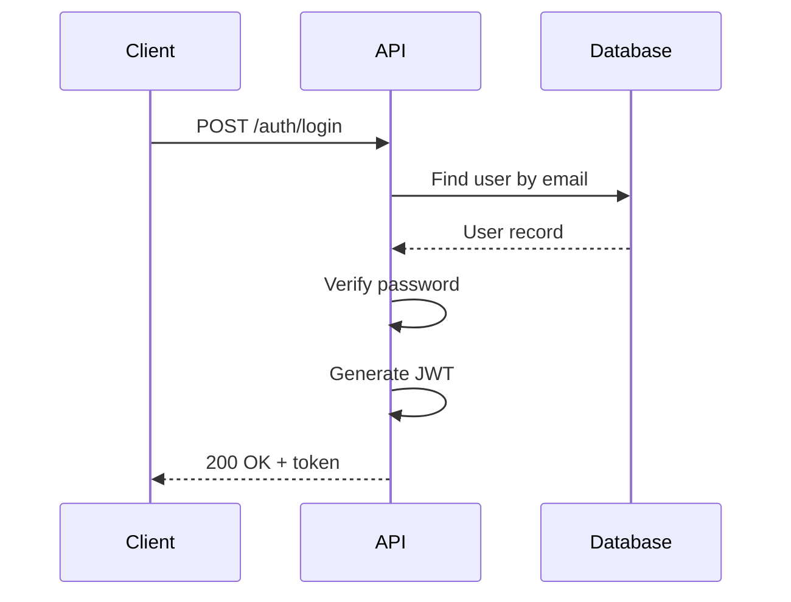
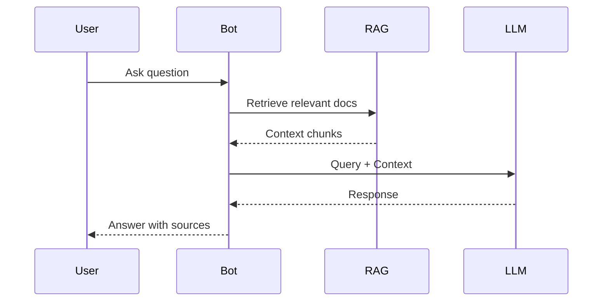
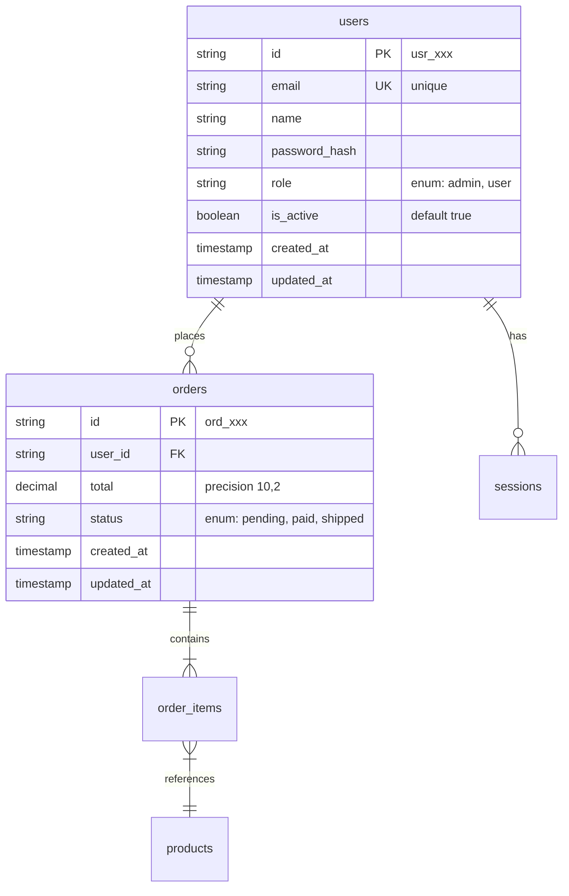

## Purpose

Generate **Detail Design (内部設計)** following IPA standard.
**Platform Agnostic** - works with any project type.

Output:
- `docs/INTERFACE_SPEC.md` - Interface specifications (API/CLI/MCP/Chat)
- `docs/DB_DESIGN.md` - Data design (SQL/NoSQL/Vector/File)

---

## Project Type Detection

| Project Type | Interface Spec | Data Design |
|--------------|----------------|-------------|
| **Web App** | REST/GraphQL API | SQL/NoSQL |
| **Desktop App** | IPC/Native API | SQLite/Local |
| **CLI Tool** | Commands/Args/Flags | Config files |
| **MCP Server** | Tools/Resources/Prompts | - |
| **Chatbot/RAG** | Conversation flows | Vector DB |
| **Library/SDK** | Public API/Methods | - |

---

## Input

**Required:**
- `docs/SRD.md`
- `docs/UI_SPEC.md`

**Optional:**
- `docs/tech-stack.md` (for implementation hints only, not required)

---

## Language-Agnostic Principle

```
┌─────────────────────────────────────────────────────────────────────┐
│                    LANGUAGE-AGNOSTIC DESIGN                         │
├─────────────────────────────────────────────────────────────────────┤
│                                                                     │
│  API_SPEC.md uses:                                                  │
│  - OpenAPI 3.x standard (YAML/JSON)                                │
│  - Standard HTTP methods (GET, POST, PUT, DELETE)                  │
│  - JSON Schema for request/response                                │
│  - NO framework-specific code                                       │
│                                                                     │
│  DB_DESIGN.md uses:                                                 │
│  - Standard SQL (DDL)                                              │
│  - ER Diagram (Mermaid)                                            │
│  - Portable data types                                              │
│  - NO ORM-specific syntax                                          │
│                                                                     │
│  Implementation notes (optional):                                   │
│  - If tech-stack.md exists, add hints for that stack               │
│  - Hints are in separate "Implementation Notes" section            │
│                                                                     │
└─────────────────────────────────────────────────────────────────────┘
```

---

## Output 1: docs/API_SPEC.md

```markdown
# API Specification (Detail Design)

## 1. Overview

**API Style:** REST
**Base URL:** `/api/v1`
**Content-Type:** `application/json`
**Authentication:** Bearer Token (JWT) / API Key / OAuth2

---

## 2. Authentication

### Token Format
```
Authorization: Bearer <token>
```

### Token Payload (if JWT)
```json
{
  "sub": "user_id",
  "email": "user@example.com",
  "role": "user",
  "exp": 1234567890
}
```

---

## 3. Endpoint Matrix

### Status Legend
| Status | Meaning |
|--------|---------|
| ⏳ | Spec only (not implemented) |
| ✅ | Implemented |
| 🔄 | Synced (docs match code) |

### Auth
| Method | Endpoint | Description | Auth | Rate Limit | Status |
|--------|----------|-------------|------|------------|--------|
| POST | /auth/login | User login | No | 10/min | ⏳ |
| POST | /auth/register | User registration | No | 5/min | ⏳ |
| POST | /auth/logout | User logout | Yes | 30/min | ⏳ |
| POST | /auth/refresh | Refresh token | Yes | 30/min | ⏳ |

### Users
| Method | Endpoint | Description | Auth | Rate Limit | Status |
|--------|----------|-------------|------|------------|--------|
| GET | /users/:id | Get user profile | Yes | 100/min | ⏳ |
| PUT | /users/:id | Update user | Yes | 30/min | ⏳ |
| DELETE | /users/:id | Delete user | Yes | 10/min | ⏳ |

### [Feature Category]
| Method | Endpoint | Description | Auth | Rate Limit | Status |
|--------|----------|-------------|------|------------|--------|
| GET | /resources | List resources | Yes | 100/min | ⏳ |
| POST | /resources | Create resource | Yes | 30/min | ⏳ |
| GET | /resources/:id | Get resource | Yes | 100/min | ⏳ |
| PUT | /resources/:id | Update resource | Yes | 30/min | ⏳ |
| DELETE | /resources/:id | Delete resource | Yes | 10/min | ⏳ |

---

## 4. Endpoint Details

### POST /api/v1/auth/login

**Traceability:** FR-01 (SRD), S-01 (UI_SPEC)

**Request:**
```yaml
content-type: application/json
body:
  type: object
  required:
    - email
    - password
  properties:
    email:
      type: string
      format: email
      description: User email address
      example: "user@example.com"
    password:
      type: string
      format: password
      minLength: 8
      description: User password
      example: "********"
```

**Response 200 (Success):**
```yaml
content-type: application/json
body:
  type: object
  properties:
    success:
      type: boolean
      example: true
    data:
      type: object
      properties:
        token:
          type: string
          description: JWT access token
        refresh_token:
          type: string
          description: Refresh token
        expires_in:
          type: integer
          description: Token expiry in seconds
          example: 3600
        user:
          type: object
          properties:
            id:
              type: string
            email:
              type: string
            name:
              type: string
```

**Response 400 (Validation Error):**
```yaml
body:
  type: object
  properties:
    success:
      type: boolean
      example: false
    error:
      type: object
      properties:
        code:
          type: string
          example: "VALIDATION_ERROR"
        message:
          type: string
          example: "Invalid email format"
        fields:
          type: array
          items:
            type: object
            properties:
              field:
                type: string
              message:
                type: string
```

**Response 401 (Unauthorized):**
```yaml
body:
  type: object
  properties:
    success:
      type: boolean
      example: false
    error:
      type: object
      properties:
        code:
          type: string
          example: "UNAUTHORIZED"
        message:
          type: string
          example: "Invalid credentials"
```

---

## 5. Common Response Format

### Success Response
```json
{
  "success": true,
  "data": { ... },
  "meta": {
    "page": 1,
    "limit": 20,
    "total": 100
  }
}
```

### Error Response
```json
{
  "success": false,
  "error": {
    "code": "ERROR_CODE",
    "message": "Human readable message",
    "details": { ... }
  }
}
```

---

## 6. Error Codes (Standard)

| HTTP Code | Error Code | Description |
|-----------|------------|-------------|
| 400 | VALIDATION_ERROR | Request validation failed |
| 400 | BAD_REQUEST | Malformed request |
| 401 | UNAUTHORIZED | Missing or invalid token |
| 403 | FORBIDDEN | Insufficient permissions |
| 404 | NOT_FOUND | Resource not found |
| 409 | CONFLICT | Resource conflict (duplicate) |
| 422 | UNPROCESSABLE | Business logic error |
| 429 | RATE_LIMITED | Too many requests |
| 500 | INTERNAL_ERROR | Server error |

---

## 7. Data Types (Standard)

| Type | Format | Example | Description |
|------|--------|---------|-------------|
| ID | string | "usr_abc123" | Prefixed unique ID |
| UUID | string (uuid) | "550e8400-..." | UUID v4 |
| DateTime | string (ISO 8601) | "2025-12-27T14:00:00Z" | UTC timestamp |
| Date | string (date) | "2025-12-27" | Date only |
| Email | string (email) | "user@example.com" | Email address |
| URL | string (uri) | "https://..." | URL |
| Decimal | string | "99.99" | Monetary values (string for precision) |

---

## 8. Pagination (Standard)

**Request:**
```
GET /api/v1/resources?page=1&limit=20&sort=created_at&order=desc
```

**Response:**
```json
{
  "success": true,
  "data": [...],
  "meta": {
    "page": 1,
    "limit": 20,
    "total": 100,
    "total_pages": 5,
    "has_next": true,
    "has_prev": false
  }
}
```

---

## 9. Sequence Diagrams



---

## 10. Implementation Notes (Optional)

> **Note:** This section is for implementation hints only.
> The API spec above is language-agnostic.

### If using Node.js/NestJS:
- Use class-validator for DTO validation
- Use passport-jwt for authentication

### If using Python/FastAPI:
- Use Pydantic for request/response models
- Use python-jose for JWT

### If using Go:
- Use go-chi or gin for routing
- Use golang-jwt for JWT

---

## 11. IPA Checklist

- [ ] All features have API endpoints (FR-xx coverage)
- [ ] Request/Response schemas complete
- [ ] Error codes standardized
- [ ] Authentication documented
- [ ] Pagination standardized
- [ ] Traceability: API ↔ Feature ↔ Screen
```

---

## Alternative: CLI Tool Interface

```markdown
# CLI Interface Specification

## 1. Overview

**CLI Name:** `mytool`
**Version:** 1.0.0
**Platform:** Cross-platform (Win/Mac/Linux)

## 2. Command Matrix

| Command | Subcommand | Description | Args | Flags |
|---------|------------|-------------|------|-------|
| `init` | - | Initialize project | `[path]` | `--template`, `-f` |
| `run` | - | Run main process | `<input>` | `--watch`, `--verbose` |
| `config` | `get` | Get config value | `<key>` | - |
| `config` | `set` | Set config value | `<key> <value>` | `--global` |

## 3. Command Details

### mytool init [path]

**Traceability:** FR-01 (SRD)

**Arguments:**
| Arg | Required | Default | Description |
|-----|----------|---------|-------------|
| path | No | `.` | Project directory |

**Flags:**
| Flag | Short | Type | Default | Description |
|------|-------|------|---------|-------------|
| --template | -t | string | `default` | Template name |
| --force | -f | bool | false | Overwrite existing |

**Output:**
- Success: `✓ Project initialized at {path}`
- Error: `✗ Directory already exists. Use -f to overwrite.`

**Exit Codes:**
| Code | Meaning |
|------|---------|
| 0 | Success |
| 1 | General error |
| 2 | Invalid arguments |
```

---

## Alternative: MCP Server Interface

```markdown
# MCP Server Specification

## 1. Overview

**Server Name:** `my-mcp-server`
**Version:** 1.0.0
**Transport:** stdio / SSE

## 2. Tools Matrix

| Tool | Description | Params | Returns |
|------|-------------|--------|---------|
| `search` | Search documents | `query`, `limit` | `Document[]` |
| `create` | Create document | `title`, `content` | `Document` |
| `delete` | Delete document | `id` | `boolean` |

## 3. Tool Details

### search

**Traceability:** FR-01 (SRD)

**Parameters:**
```json
{
  "query": {
    "type": "string",
    "description": "Search query",
    "required": true
  },
  "limit": {
    "type": "number",
    "description": "Max results",
    "default": 10
  }
}
```

**Returns:**
```json
{
  "type": "array",
  "items": {
    "type": "object",
    "properties": {
      "id": "string",
      "title": "string",
      "score": "number"
    }
  }
}
```

## 4. Resources

| URI Pattern | Description | MIME Type |
|-------------|-------------|-----------|
| `doc://{id}` | Get document | `text/plain` |
| `docs://list` | List all docs | `application/json` |

## 5. Prompts

| Name | Description | Arguments |
|------|-------------|-----------|
| `summarize` | Summarize document | `doc_id` |
| `analyze` | Analyze content | `content`, `type` |
```

---

## Alternative: Chatbot/RAG Interface

```markdown
# Chatbot Interface Specification

## 1. Overview

**Bot Name:** `assistant`
**Type:** RAG-based chatbot
**LLM:** Claude / GPT-4

## 2. Conversation Flows

### Flow: General Query


## 3. Intent Matrix

| Intent | Examples | Action | Response Type |
|--------|----------|--------|---------------|
| `greeting` | "hello", "hi" | - | Greeting message |
| `question` | "what is...", "how to..." | RAG lookup | Answer + sources |
| `action` | "create...", "delete..." | Execute tool | Confirmation |
| `clarify` | "what do you mean" | - | Clarification |

## 4. RAG Configuration

| Setting | Value | Description |
|---------|-------|-------------|
| Chunk size | 512 tokens | Document chunk size |
| Overlap | 50 tokens | Chunk overlap |
| Top K | 5 | Retrieved chunks |
| Embedding | text-embedding-3-small | Embedding model |
| Vector DB | Pinecone / Chroma | Storage |

## 5. Response Templates

### Answer with Sources
```
{answer}

Sources:
- [{title}]({url}) (relevance: {score})
```

### Clarification
```
I'm not sure I understand. Did you mean:
1. {option_1}
2. {option_2}
```
```

---

## Output 2: docs/DB_DESIGN.md

```markdown
# Database Design (Detail Design)

## 1. Overview

**Database Type:** Relational (PostgreSQL/MySQL compatible)
**Naming Convention:** snake_case
**ID Strategy:** [UUID / ULID / Prefixed nanoid]

---

## 2. Entity-Relationship Diagram



---

## 3. Table Definitions (SQL Standard)

### users

**Traceability:** E-01 (SRD)

```sql
CREATE TABLE users (
    id VARCHAR(20) PRIMARY KEY,
    email VARCHAR(255) NOT NULL UNIQUE,
    name VARCHAR(100) NOT NULL,
    password_hash VARCHAR(255) NOT NULL,
    role VARCHAR(20) NOT NULL DEFAULT 'user',
    is_active BOOLEAN NOT NULL DEFAULT TRUE,
    created_at TIMESTAMP NOT NULL DEFAULT CURRENT_TIMESTAMP,
    updated_at TIMESTAMP NOT NULL DEFAULT CURRENT_TIMESTAMP,

    CONSTRAINT chk_users_role CHECK (role IN ('admin', 'user', 'moderator'))
);

-- Indexes
CREATE INDEX idx_users_email ON users(email);
CREATE INDEX idx_users_role ON users(role);
CREATE INDEX idx_users_created_at ON users(created_at);
```

**Columns:**
| Column | Type | Constraints | Description |
|--------|------|-------------|-------------|
| id | VARCHAR(20) | PK | Prefixed ID (usr_xxx) |
| email | VARCHAR(255) | UNIQUE, NOT NULL | User email |
| name | VARCHAR(100) | NOT NULL | Display name |
| password_hash | VARCHAR(255) | NOT NULL | Hashed password |
| role | VARCHAR(20) | NOT NULL, CHECK | User role |
| is_active | BOOLEAN | NOT NULL | Account status |
| created_at | TIMESTAMP | NOT NULL | Creation time |
| updated_at | TIMESTAMP | NOT NULL | Last update |

---

## 4. Data Types (Standard SQL)

| Logical Type | SQL Type | Description |
|--------------|----------|-------------|
| ID | VARCHAR(20-36) | String ID (nanoid/UUID) |
| Short Text | VARCHAR(100) | Names, titles |
| Long Text | VARCHAR(255) | Emails, URLs |
| Content | TEXT | Long content |
| Integer | INTEGER | Whole numbers |
| Decimal | DECIMAL(10,2) | Money, precise decimals |
| Boolean | BOOLEAN | True/false |
| DateTime | TIMESTAMP | Date and time |
| Date | DATE | Date only |
| JSON | JSONB / JSON | Structured data |
| Enum | VARCHAR + CHECK | Constrained values |

---

## 5. Relationships

| Parent | Child | Type | FK Column | On Delete |
|--------|-------|------|-----------|-----------|
| users | orders | 1:N | user_id | CASCADE |
| users | sessions | 1:N | user_id | CASCADE |
| orders | order_items | 1:N | order_id | CASCADE |
| products | order_items | 1:N | product_id | RESTRICT |

---

## 6. Indexes Strategy

| Table | Index Name | Columns | Type | Purpose |
|-------|------------|---------|------|---------|
| users | idx_users_email | email | UNIQUE | Login lookup |
| users | idx_users_role | role | BTREE | Role filtering |
| orders | idx_orders_user_id | user_id | BTREE | User orders |
| orders | idx_orders_status | status | BTREE | Status filtering |
| orders | idx_orders_created_at | created_at | BTREE | Date sorting |

---

## 7. Constraints

### Foreign Keys
```sql
ALTER TABLE orders
ADD CONSTRAINT fk_orders_user
FOREIGN KEY (user_id) REFERENCES users(id) ON DELETE CASCADE;
```

### Check Constraints
```sql
ALTER TABLE orders
ADD CONSTRAINT chk_orders_total
CHECK (total >= 0);

ALTER TABLE orders
ADD CONSTRAINT chk_orders_status
CHECK (status IN ('pending', 'paid', 'shipped', 'cancelled'));
```

---

## 8. Soft Delete Pattern (Optional)

```sql
-- Add to tables requiring soft delete
ALTER TABLE users ADD COLUMN deleted_at TIMESTAMP NULL;

-- Query active records
SELECT * FROM users WHERE deleted_at IS NULL;

-- Soft delete
UPDATE users SET deleted_at = CURRENT_TIMESTAMP WHERE id = 'usr_xxx';
```

---

## 9. Audit Columns (Standard)

Every table should have:
```sql
created_at TIMESTAMP NOT NULL DEFAULT CURRENT_TIMESTAMP,
updated_at TIMESTAMP NOT NULL DEFAULT CURRENT_TIMESTAMP,
created_by VARCHAR(20) NULL,  -- Optional
updated_by VARCHAR(20) NULL   -- Optional
```

---

## 10. Migration Notes

### Initial Migration
```sql
-- Run in order:
-- 1. Create enums/types if needed
-- 2. Create tables (parents first)
-- 3. Add foreign keys
-- 4. Create indexes
-- 5. Insert seed data
```

### Version Control
- Each migration has unique ID (timestamp-based)
- Migrations are idempotent where possible
- Include both UP and DOWN scripts

---

## 11. Implementation Notes (Optional)

> **Note:** This section is for implementation hints only.
> The schema above is standard SQL.

### If using Drizzle ORM:
```typescript
// Convert to Drizzle schema
export const users = pgTable('users', {
  id: varchar('id', { length: 20 }).primaryKey(),
  email: varchar('email', { length: 255 }).notNull().unique(),
  // ...
});
```

### If using Prisma:
```prisma
model User {
  id    String @id @db.VarChar(20)
  email String @unique @db.VarChar(255)
  // ...
}
```

### If using SQLAlchemy:
```python
class User(Base):
    __tablename__ = 'users'
    id = Column(String(20), primary_key=True)
    email = Column(String(255), unique=True, nullable=False)
    # ...
```

---

## 12. IPA Checklist

- [ ] All entities from SRD covered (E-xx)
- [ ] ERD complete and accurate
- [ ] All relationships defined
- [ ] Indexes for query optimization
- [ ] Constraints (PK, FK, UK, CHECK) defined
- [ ] Data types standardized
- [ ] Audit columns present
- [ ] Traceability: Table ↔ Entity ↔ Feature
```

---

## Workflow

1. Read `docs/SRD.md` for entities and features
2. Read `docs/UI_SPEC.md` for screen → API mapping
3. Generate `docs/API_SPEC.md` (OpenAPI standard)
4. Generate `docs/DB_DESIGN.md` (SQL standard)
5. Optionally add implementation notes if tech-stack.md exists
6. Ask user to review

---

## After Generation

1. Save to `docs/API_SPEC.md` and `docs/DB_DESIGN.md`
2. Verify traceability: API ↔ Screen ↔ Feature ↔ Entity
3. Ask user to review
4. Ready for `/plan` to create implementation tasks

**IMPORTANT:** Do not implement code. Only generate documentation.
